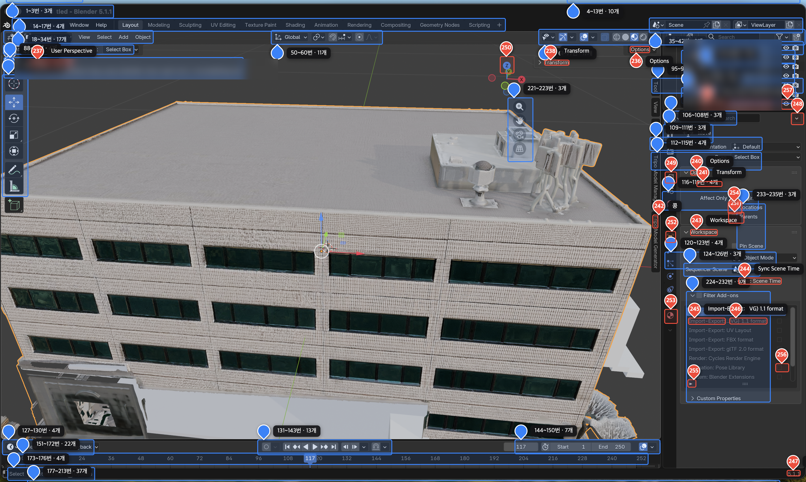

# screen-callout

Capture your Mac screen, detect every clickable UI element with AI, and overlay
**numbered callouts** on top of the live screen — a transparent, click-through
layer that labels what each button/icon is. Built for non-developers who want to
understand unfamiliar app UIs (Blender, etc.).



## How it works

| Part | Tool | Role |
|---|---|---|
| Detect + group | Python | `scan.sh` → `detect_combined.py` (text + icons) → `group_callouts.py` (grouping + numbering) → `callouts.json` |
| Overlay | Electron | `main.js` reads `callouts.json` and draws callouts on a transparent, click-through window |

```
scan.sh
  → screencapture                  (now.png)
  → detect_combined.py             (easyocr text boxes + UI-DETR icon/element boxes)
  → group_callouts.py              (cluster same-bar items, assign unique numbers)
  → callouts.json
  → Electron overlay renders numbered callouts
    · red pin   = single item
    · blue box  = group ("3–8 · 6 items"); click to expand into members
```

Detection is **two complementary models**: [EasyOCR](https://github.com/JaidedAI/EasyOCR)
reads text labels, and [UI-DETR-1](https://huggingface.co/racineai/UI-DETR-1)
(RF-DETR, class-agnostic) finds clickable elements including icons with no text.
Use `python3 explain.py <n>` to gather signals (nearby text, region, app hint, an
image crop) for explaining any callout number.

## Learning Mode

Keep an app open and learn it interactively: number everything on screen, then ask
an AI assistant (e.g. Claude) about any element **by number, both ways**.

| Hotkey | Action |
|---|---|
| **`Option+1`** | Rescan the monitor your mouse is on → regenerate the numbered overlay |
| **`Option+2`** | Pause/resume the overlay (hide callouts + click-through) |

The assistant builds a semantic map (`index.json`) that tags each number with a
**category** (purpose) and a one-line description, enabling two-way queries:

- number → function — *"what is #47?"*
- function → number — *"which number adds an object?"*, *"which numbers switch workspace?"*

Numbers are reassigned on every rescan, so the old map is automatically discarded at
the start of each rescan — answers always match the current screen.

## Requirements

- **macOS on Apple Silicon** (uses `screencapture` / `sips`, PyTorch MPS)
- Node.js (Electron) and Python 3
- **Screen Recording** permission: System Settings → Privacy & Security → Screen Recording

## Install

```bash
npm install
pip install -r requirements.txt        # easyocr, opencv-python, rfdetr, Pillow

# Download the UI-DETR model weights (~510 MB, MIT, not bundled in this repo)
python3 -c "from huggingface_hub import hf_hub_download; \
hf_hub_download('racineai/UI-DETR-1','model.pth',local_dir='weights-uidetr')"
```

## Usage

```bash
npm start                 # start the transparent overlay (watches callouts.json)
./scan.sh                 # capture current screen → detect → group → callouts.json
python3 explain.py 37     # collect signals to explain callout #37
```

Re-run `./scan.sh` whenever the screen changes — callouts are a static snapshot of
the captured frame.

## Coordinate rule (Retina-safe)

All coordinates in `callouts.json` are **0–1 ratios** (`x = pixel / image_width`),
so they map to the right place regardless of screen size or Retina scale factor.

## Limitations

- Static snapshot (re-scan after the screen changes); primary monitor only
- Icons have positions but **no names** (UI-DETR is class-agnostic) — names are
  inferred on demand from nearby text + an image crop
- macOS / Apple Silicon only

## License

Apache License 2.0 — see [LICENSE](LICENSE) and [NOTICE](NOTICE) for third-party
attributions.

> Mac and macOS are registered trademarks of Apple Inc.; this is an unofficial
> project not affiliated with Apple. Blender is a trademark of the Blender Foundation.
